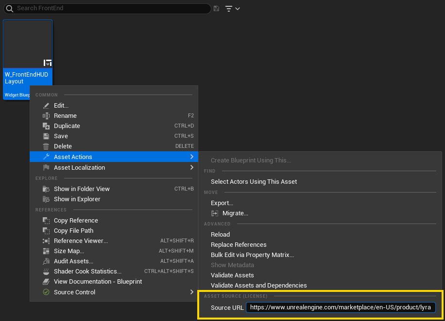
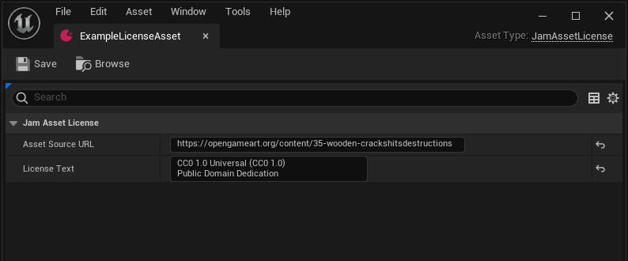
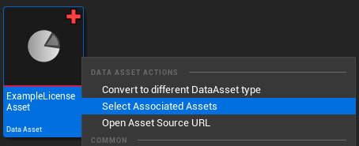

# JamLicenseTracker plugin for Unreal Engine

This plugin helps assist in tracking the source of assets used under license.

## Quick Start and Usage

It's easy to get up and running:

* Download the JamLicenseTracker plugin source from this page (click **Clone or download** -> **Download ZIP**).

* Unzip the files into a new **JamLicenseTracker** sub-folder under your project's **Plugins** folder.  It should end up looking like *"/MyProject/Plugins/JamLicenseTracker/<files>"*

* **Rebuild** your C++ project.  The new plugin will be compiled too!

* Load the editor.

* You will get two message log notifications about project settings that need to be updated.  **Accept the actions offered, which will update your DefaultGame.ini**

* Select some assets you want to annotate with a source in the Content Browser.

* Expand the Asset Actions submenu and enter a value in the Source URL entry.

* You can also create a data asset of type UJamAssetLicense (New Asset .. Miscellaneous .. Data Asset, pick JamAssetLicense) in order to create an association between an asset source URL and actual license text (e.g., the CC-BY attribution required for those assets).

* You can select the assets that share the same source via the context menu on the license asset you created:

## Plugin Details

### Implementation Details

The menu options store the source URL in package metadata (in a key named "AssetSourceURL"), which is in turn specified as metadata to be copied into the asset registry via project settings.

This allows the plugin to find other assets from the same source even when those assets are unloaded.

### Known Issues

The runtime harvesting of licenses that survived cooking is not implemented yet.  See the @TODO in JamLicenseTrackerEditorModule.cpp

### Compatibility

This plugin requires Visual Studio and either a C++ code project or the full Unreal Engine source code from GitHub.

The plugin has only been tested on Windows with Visual Studio 2022 and the 5.0.1 release of UE, although it should be portable to other platforms and future versions of Unreal Engine.

## Support

This plugin should be considered 'jam-quality' code, it hasn't been battle tested in production.

Feel free to file an issue, submit a pull request, or catch me [on Twitter](https://twitter.com/joatski), but there is no expectation or guarantee of any future development or fixes.
